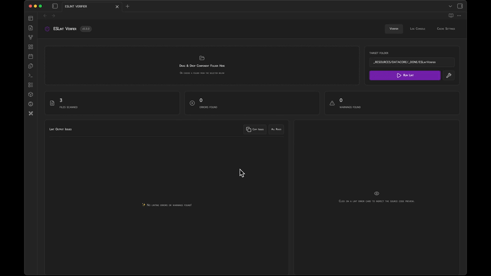

  
  
  <h1 align="center">ESLintVerifier</h1>
  <h3 align="center"> Interactive Obsidian Datacore Component ESLint Checker </h3>

  <!-- TOP PURPLE LINKS -->
  
  
  
   
  <!-- BOTTOM GOLD TAXONOMY -->
  
  
  
  

  

  

    <i> An interactive developer tool to check and fix Obsidian Datacore components against official Obsidian ESLint verification rules. </i>
  

  

Welcome to **ESLint Verifier**, a component linting and verification platform designed for Obsidian Datacore developers. By running a localized ESLint engine and leveraging the recommended rules of `eslint-plugin-obsidianmd`, it helps you quickly locate and autofix code quality issues.

---

## 🚀 Quick Start

To use ESLint Verifier today:
1. **Download the Repository**: Clone or download this repository directly into any folder inside your Obsidian vault.
2. **Install Datacore**: Ensure you have the **Datacore** plugin installed and enabled in Obsidian.
3. **Open the Entry Note**: Open the **`ESLINT VERIFIER.md`** note inside Obsidian to launch the component!

---

## ✨ Features

### 🔄 Dynamic ESLint Caching & Updates
*   📦 **One-Click Local Cache Setup**: Automatically downloads and installs the necessary version of `eslint` and `eslint-plugin-obsidianmd` into a local `data/cache` directory.
*   ⚡ **Dynamic NPM Checks**: Automatically queries NPM to check if newer versions of ESLint or the Obsidian ESLint plugin are available and updates them cleanly.

### 🌌 Interactive Drag-and-Drop & Picker
*   📂 **Drag-and-Drop Target**: Drag a component folder from your Obsidian file explorer or your operating system directly into the lint zone.
*   🚜 **Path Auto-Resolution**: Automatically matches and resolves note paths to execute local file system checks.

### 🎨 Visual Results Explorer & Autofix
*   🌓 **Detailed Lint Console**: Browse through errors and warnings categorized by file and rule. Click to view the exact code lines.
*   🛠️ **One-Click Autofix**: Run the `--fix` pipeline instantly on the target component.
*   🚀 **Obsidian File Bridge**: Click any lint error row to open the source file in your active Obsidian pane at the exact line!

---

## 📦 Directory Index & Components

The package exposes the following compiled files:

| File | Description |
| :--- | :--- |
| **[`ESLINT VERIFIER.md`](ESLINT%20VERIFIER.md)** | The main entry point note designed to be opened in Obsidian. |
| **[`src/index.jsx`](src/index.jsx)** | Bootstrapper component with dynamic status-bar and scrollbar suppression. |
| **[`src/App.jsx`](src/App.jsx)** | Main component shell containing UI states, drag-and-drop handler, and ESLint runners. |
| **[`assets/`](assets/)** | Media assets including preview clips, walkthroughs, and images. |
| **[`data/`](data/)** | Local data caches and temporary ESLint rule configurations. |
| **[`METADATA.md`](METADATA.md)** | Manifest mapping indexing properties and target runtime. |
| **[`CONTRIBUTION.md`](CONTRIBUTION.md)** | Local execution guidelines. |
| **[`LICENSE.md`](LICENSE.md)** | MIT license configuration. |
